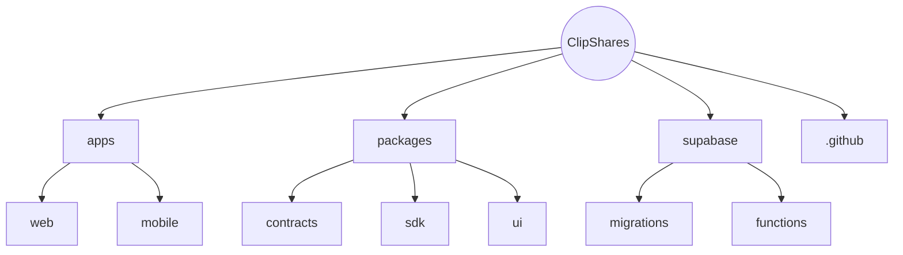

# ClipShares

ClipShares is a mono-repo for a Web + iOS + Android dApp that lets creators tokenize their channels and share ad revenue via ERC-20 shares and micro-dividends.

## Tech Stack

- **Backend**: Supabase (Postgres + Edge Functions + RLS)
- **Smart Contracts**: Thirdweb SDK + Hardhat
- **Web**: React + Vite + Tailwind CSS + wagmi + ethers.js
- **Mobile**: Expo React Native + React Navigation + wagmi-core + WalletConnect v2
- **Video CDN**: Livepeer (upload + HLS playback)
- **Blockchain**: Polygon PoS (Mumbai testnet)
- **DevTools**: pnpm workspaces, TurboRepo, ESLint, Prettier, Jest
- **CI/CD**: GitHub Actions, EAS Build & Submit

## Prerequisites

- Node.js 18.x
- pnpm
- Supabase CLI
- Docker
- Expo CLI

## Environment Variables

Copy `.env.template` to `.env` and fill in:
```bash
SUPABASE_URL=
SUPABASE_ANON_KEY=
SERVICE_ROLE_KEY=
RPC_URL=
PRIVATE_KEY=
VIDE_ADDR=
FORWARDER_ADDR=
LIVEPEER_API_KEY=
```

## Setup & Run

```bash
git clone <repo-url>
cd ClipShares
pnpm install
supabase start
pnpm dev:contracts       # Hardhat local node + deploy scripts (Mumbai)
# fill in .env
pnpm dev:web             # http://localhost:5173
pnpm dev:mobile          # Expo Metro bundler
```

## Repository Structure


